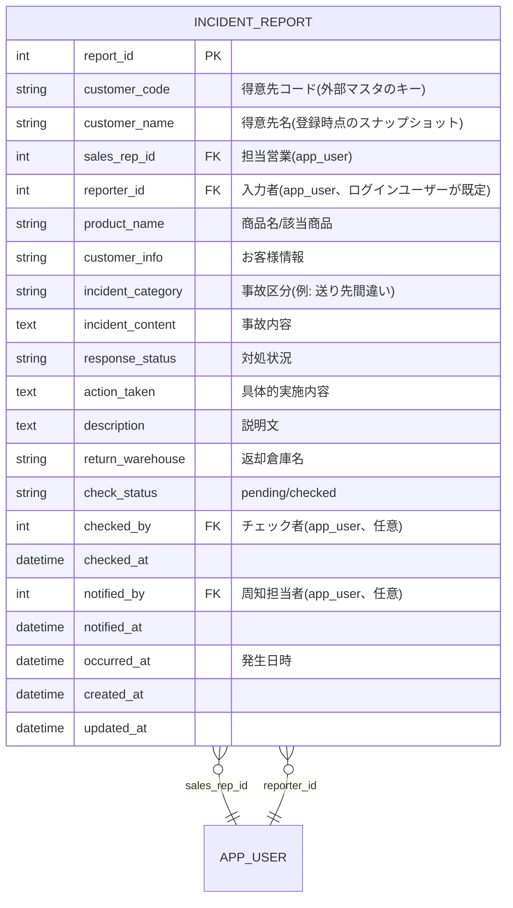

# 事故報告機能 設計

作成日: 2026-08-29
参照元: `requirements.md`、`docs/functional-design.md`(既存モジュールとの整合)、`docs/architecture.md`
ステータス: ドラフト(要承認。得意先マスタのビュー名・カラム構成、チェック者フローの詳細はDB側準備待ちのため仮置き)

---

## 1. 実装アプローチ

既存の機能モジュール(掲示板・カレンダー等)と同じ構成パターン(型定義→mssqlリポジトリ→サービス→ルーティング、DB非依存のフェイクリポジトリでユニットテスト)を踏襲する。新規モジュール名は `incidentReports` とする。

1. DBスキーマ: `incident_report` テーブルを新設するマイグレーションを追加する。
2. 得意先マスタ参照: 本アプリのDBサーバー(`10.194.5.57`)上に用意されるビュー(ビュー名は仮置き、DB側準備後に確定)を`SELECT`するだけの読み取り専用リポジトリを実装する。リンクドサーバー越しの`10.194.5.55`参照はDB側で吸収済みのため、アプリ側は通常のクエリを投げるだけでよい。
3. バックエンド: 事故報告のCRUD、担当営業による絞り込み検索、操作ログ連携(既存の`OperationLogRepository`を再利用)を実装する。
4. フロントエンド: 一覧(担当営業フィルタ)・新規登録・詳細(チェック/周知記録)画面を実装する。
5. 権限まわりは要件未確定の部分(チェック・周知操作の権限)があるため、MVPでは「閲覧・登録・チェック・周知すべて一般社員であれば誰でも操作可能」とし、後日の要件確定時に絞り込む前提で実装する(要承認)。

## 2. 変更するコンポーネント

**バックエンド(新規、`backend/src/modules/incidentReports/`)**
- `types.ts` — `IncidentReport`, `CreateIncidentReportInput`, `UpdateIncidentReportInput`, `IncidentReportRepository`, `CustomerMasterRepository`
- `incidentReportRepository.mssql.ts`
- `customerMasterRepository.mssql.ts` — 得意先マスタビューの読み取り専用リポジトリ(ビュー名は仮置き `dbo.vw_customer_master`、要確定)
- `incidentReportService.ts`
- `incidentReportRoutes.ts` — `/api/incident-reports`, `/api/customers`

**フロントエンド(新規、`frontend/src/pages/incidentReports/`)**
- `IncidentReportListPage.tsx` — 一覧、担当営業での絞り込み
- `NewIncidentReportPage.tsx` — 新規登録フォーム
- `IncidentReportDetailPage.tsx` — 詳細、チェック状態・周知記録の更新
- `frontend/src/api/incidentReports.ts`, `frontend/src/api/customers.ts`

**共通**
- `docs/repository-structure.md`・`docs/functional-design.md`は、機能が確定次第(要件未確定事項の解消後)更新する(CLAUDE.mdの「永続的ドキュメント更新は必要な場合のみ」に従う)。

## 3. データ構造の変更

### 3-1. 新規テーブル(マイグレーション `012_incident_reports.sql`)



DDL(T-SQL、案):

```sql
CREATE TABLE incident_report (
    report_id        INT IDENTITY(1,1) PRIMARY KEY,
    customer_code    NVARCHAR(50)  NOT NULL,
    customer_name    NVARCHAR(200) NULL,
    sales_rep_id     INT NOT NULL,
    reporter_id      INT NOT NULL,
    product_name     NVARCHAR(200) NULL,
    customer_info    NVARCHAR(500) NULL,
    incident_category NVARCHAR(50) NULL,
    incident_content NVARCHAR(MAX) NULL,
    response_status  NVARCHAR(200) NULL,
    action_taken     NVARCHAR(MAX) NULL,
    description      NVARCHAR(MAX) NULL,
    return_warehouse NVARCHAR(100) NULL,
    check_status     NVARCHAR(20) NOT NULL DEFAULT 'pending' CHECK (check_status IN ('pending', 'checked')),
    checked_by       INT NULL,
    checked_at       DATETIME2 NULL,
    notified_by      INT NULL,
    notified_at      DATETIME2 NULL,
    occurred_at      DATETIME2 NOT NULL,
    created_at       DATETIME2 NOT NULL DEFAULT SYSUTCDATETIME(),
    updated_at       DATETIME2 NOT NULL DEFAULT SYSUTCDATETIME(),
    CONSTRAINT fk_incident_report_sales_rep FOREIGN KEY (sales_rep_id) REFERENCES app_user (user_id),
    CONSTRAINT fk_incident_report_reporter FOREIGN KEY (reporter_id) REFERENCES app_user (user_id),
    CONSTRAINT fk_incident_report_checked_by FOREIGN KEY (checked_by) REFERENCES app_user (user_id),
    CONSTRAINT fk_incident_report_notified_by FOREIGN KEY (notified_by) REFERENCES app_user (user_id)
);

CREATE INDEX ix_incident_report_sales_rep ON incident_report (sales_rep_id);
CREATE INDEX ix_incident_report_customer_code ON incident_report (customer_code);
```

**設計上の注意点**:
- `customer_name`は入力時点の得意先マスタの値をスナップショットとして保持する(マスタ側で得意先名が変更されても過去の報告書の表示は変わらないようにするため)。一覧の絞り込みでは`customer_code`を使う。
- `incident_category`(事故区分)は元のExcelでは選択式の可能性が高いが、選択肢の全リストが未確認のため、当面は自由入力のNVARCHARとする。選択肢が確定次第、CHECK制約またはマスタテーブル化を検討する。
- `check_status`は要件未確定の「チェック者フロー」を最小実装した仮の設計(pending/checkedの単純フラグ)。承認・差し戻し等のワークフローが必要と確定した場合は別途拡張する。

### 3-2. 得意先マスタ参照(既存ビュー、新規テーブルではない)

```sql
-- ビュー名・カラム名は仮置き。DB側の準備が整い次第、正式名称に置き換える。
SELECT customer_code, customer_name, sales_rep_id
FROM dbo.vw_customer_master
WHERE customer_code = @customerCode
```

`CustomerMasterRepository`は読み取り専用とし、書き込み操作は一切行わない。

## 4. 影響範囲の分析

- 既存のスキーマ(post, calendar_event等)への変更はない。新規テーブル追加のみで既存機能に影響しない。
- `OperationLogRepository`(3章で実装済み)を再利用するため、`operation_log.target_type = 'incident_report'`が新たに増える。既存の掲示板・ファイル共有のログと同じテーブルに混在するが、`target_type`で区別できるため問題ない。
- 得意先マスタのビューが未整備の間は、`customer_code`の自動補完・検証ができないため、**当面は得意先コード・得意先名を手入力**とし、ビューが利用可能になった時点で自動補完(タイプアヘッド検索)に切り替える2段階の実装とする。
- 権限モデル(要件未確定)が後日変更される可能性があるため、権限チェックをサービス層の1箇所(`assertCanCheck`等)に集約し、変更が容易な設計にする。

---

## 未確認事項

`requirements.md`の未確認事項を参照。特に以下は実装前に確定が望ましい。

- 得意先マスタ参照用ビューのビュー名・カラム構成
- チェック・周知記録の操作権限
- 事故区分(選択式の場合の選択肢一覧)
