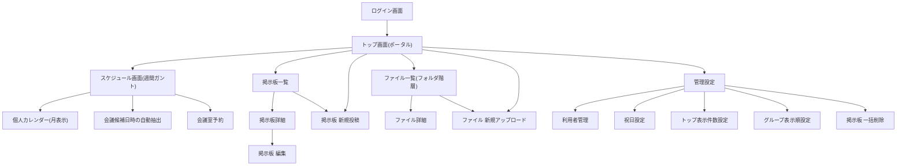
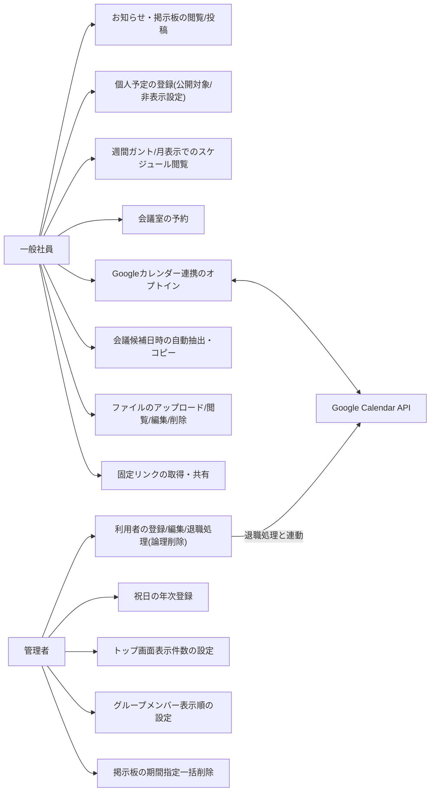
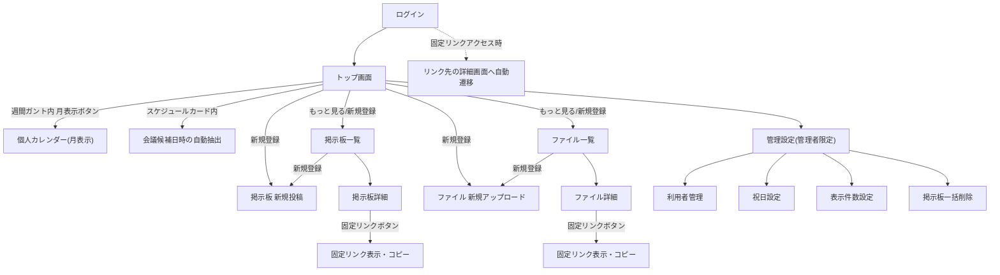

# 機能設計書

作成日: 2026-08-27
参照元: `docs/product-requirements.md`、`casemax_groupware_requirements.md`、`docs/mockups/casemax_mockup_top.html`、`docs/mockups/casemax_mockup_meeting_finder.html`
ステータス: ドラフト(要承認)

---

## 1. システム構成図

自社所有のオンプレミスWebサーバー上にアプリケーション・DB・ファイル実体を配置する構成(要件定義書 6-1章)。Googleカレンダー連携のみ外部APIに依存する。

```mermaid
graph TB
    subgraph Client["クライアント"]
        Browser["社内PC / iPhone ブラウザ"]
        GCal["Googleカレンダーアプリ(iPhone等)"]
    end

    subgraph OnPrem["オンプレミスWebサーバー"]
        WebApp["Webアプリケーション\n(掲示板/カレンダー/ファイル共有/管理設定)"]
        DB[("DBサーバー\n構造化データ + ファイルメタデータ")]
        FileStore[("ローカルディスク\nファイル実体(バイナリ)")]
    end

    subgraph External["外部サービス"]
        GoogleCal["Google Calendar API\n(個人セカンダリカレンダー)"]
    end

    subgraph Backup["バックアップ(物理的に別の場所)"]
        BackupStore[("日次バックアップ先")]
    end

    Browser -->|HTTPS| WebApp
    WebApp --> DB
    WebApp --> FileStore
    WebApp <-->|OAuth連携・双方向同期\n(個人予定のみ)| GoogleCal
    GoogleCal -->|プッシュ通知| GCal
    DB -.日次.-> BackupStore
    FileStore -.日次.-> BackupStore
```

**方針**:
- ファイルの実体(バイナリ)はDBに格納せず、ローカルディスクに保存する(BLOB化は行わない)。
- 会議室予約・祝日・会社休日はGoogle側との双方向同期の対象外とし、グループウェア側を唯一の正とする一方向反映(閲覧用)に留める。
- 個人予定のみ、社内予定専用のセカンダリカレンダーを介して双方向同期する。

---

## 2. データモデル定義(ER図)

```mermaid
erDiagram
    USER ||--o{ USER_GROUP : "所属(多対多)"
    GROUP ||--o{ USER_GROUP : "所属(多対多)"
    USER ||--o{ POST : "投稿"
    USER ||--o{ COMMENT : "コメント"
    POST ||--o{ COMMENT : "コメントを持つ"
    POST ||--o{ ATTACHMENT : "添付を持つ"
    USER ||--o{ CALENDAR_EVENT : "登録"
    GROUP ||--o{ CALENDAR_EVENT : "会社休日は全員向け予定として登録"
    USER ||--o{ ROOM_RESERVATION : "予約"
    MEETING_ROOM ||--o{ ROOM_RESERVATION : "予約対象"
    USER ||--o| GOOGLE_CALENDAR_LINK : "任意連携(オプトイン)"
    USER ||--o{ FILE_ITEM : "アップロード/更新"
    FOLDER ||--o{ FILE_ITEM : "格納"
    FOLDER ||--o{ FOLDER : "階層"
    FILE_ITEM ||--o{ FILE_VERSION : "バージョン履歴"
    USER ||--o{ OPERATION_LOG : "操作"
    GROUP ||--o{ GROUP_MEMBER_ORDER : "表示順設定"
    USER ||--o{ GROUP_MEMBER_ORDER : "表示順"

    USER {
        string user_id PK
        string login_id
        string password_hash
        string name
        string email "社内連絡先用、ログイン非連動"
        string employee_no
        string role "admin / general"
        string status "active / retired(論理削除)"
    }
    GROUP {
        string group_id PK
        string name "部署等"
    }
    USER_GROUP {
        string user_id FK
        string group_id FK
    }
    POST {
        string post_id PK
        string author_id FK
        string title
        text body_html "サニタイズ済みリッチテキスト"
        string visibility_scope "全社/部署別"
        datetime updated_at
        string permalink_slug
    }
    COMMENT {
        string comment_id PK
        string post_id FK
        string author_id FK
        text body
        datetime created_at
    }
    ATTACHMENT {
        string attachment_id PK
        string post_id FK
        string file_path
        string file_name
    }
    CALENDAR_EVENT {
        string event_id PK
        string owner_id FK
        string title
        datetime start_at
        datetime end_at
        string visibility "自分/全員"
        boolean is_hidden "非表示チェック"
        boolean is_recurring
        string recurrence_rule
        string event_type "個人予定/会社休日/祝日連携表示"
    }
    MEETING_ROOM {
        string room_id PK
        string name
        int capacity
        string equipment
    }
    ROOM_RESERVATION {
        string reservation_id PK
        string room_id FK
        string reserver_id FK
        datetime start_at
        datetime end_at
        string linked_event_id FK "カレンダー予定との連動"
    }
    GOOGLE_CALENDAR_LINK {
        string user_id PK, FK
        string secondary_calendar_id
        string oauth_refresh_token_encrypted
        string webhook_channel_id
        datetime webhook_expiration
        string sync_status
    }
    FOLDER {
        string folder_id PK
        string parent_folder_id FK
        string name
    }
    FILE_ITEM {
        string file_id PK
        string folder_id FK
        string file_name
        string current_path
        string updated_by FK
        datetime updated_at
        string permalink_slug
    }
    FILE_VERSION {
        string version_id PK
        string file_id FK
        int version_no
        string file_path
        datetime created_at
    }
    OPERATION_LOG {
        string log_id PK
        string actor_id FK
        string target_type "post/file/user/holiday etc."
        string target_id
        string action "create/update/delete/bulk_delete"
        datetime occurred_at
    }
    HOLIDAY {
        string holiday_id PK
        date holiday_date
        string name
        int fiscal_year
    }
    TOP_PAGE_SETTING {
        string setting_id PK
        int board_display_count
        int file_display_count
    }
    GROUP_MEMBER_ORDER {
        string group_id FK
        string user_id FK
        int display_order
    }
```



**設計上の要点**:
- `USER_GROUP` は多対多の中間テーブル。1人の社員が複数グループに所属できる(要件3-7)。
- `CALENDAR_EVENT.visibility` は「自分」「全員」の2値(3-8/3-9章の確定に基づき「グループ」は廃止)。`is_hidden` は独立フラグ。
- `HOLIDAY`(祝日)は専用テーブルで管理者が年次登録。会社休日は `CALENDAR_EVENT`(`event_type = 会社休日`, `visibility = 全員`)として通常の予定登録機能で扱う。カレンダー画面では両方を取得して重ねて表示する。
- `ROOM_RESERVATION` はGoogle双方向同期の対象外。`GOOGLE_CALENDAR_LINK` は個人予定のみを対象とする。
- ファイル共有はアクセス権限テーブルを持たない(全社員が閲覧・編集・削除可能という方針のため)。
- ゴミ箱テーブルは持たない。誤削除の追跡は `OPERATION_LOG` に一本化する。
- `PERMALINK_SLUG` は `POST` / `FILE_ITEM` に持たせ、固定リンクURLの解決に使う。

---

## 3. コンポーネント設計

### 3-1. フロントエンド画面構成



### 3-2. バックエンドモジュール構成

| モジュール | 責務 |
|---|---|
| 認証・セッション | ログインID/パスワード認証、パスワードハッシュ化、固定リンク経由アクセス時のログイン後リダイレクト |
| 利用者管理 | ユーザーCRUD、権限区分(管理者/一般)、所属グループ(多対多)、論理削除(退職処理) |
| 掲示板 | 投稿CRUD、リッチテキストのサニタイズ、コメント、既読管理、期間指定一括削除、固定リンク発行 |
| カレンダー | 個人予定CRUD、公開対象・非表示制御、繰り返し予定、週間ガント/月表示データ取得 |
| 休日管理 | 祝日マスタ管理(年次登録)、会社休日(通常予定として登録されたデータの参照) |
| 会議室予約 | 会議室マスタ、予約CRUD、二重予約防止(排他制御)、カレンダー連動表示 |
| Google連携 | OAuth認可フロー、セカンダリカレンダーへの双方向同期、Webhook購読・更新、退職時の予定削除・トークン失効 |
| 会議候補日時抽出 | 対象者のfree/busy計算、営業時間・休日除外、候補提示、テキスト生成 |
| ファイル共有 | フォルダ階層管理、アップロード/ダウンロード、バージョン管理、固定リンク発行 |
| 操作ログ | 掲示板・ファイルの編集/削除/一括削除の記録 |
| トップ画面集約 | スケジュール・掲示板・ファイルの最新情報を集約するAPI(表示件数は管理設定値を参照) |
| バックアップ | DB・ファイル実体を物理的に別の場所へ日次バックアップ |

---

## 4. ユースケース図



---

## 5. 画面遷移図



**ナビゲーション状態の扱い(要件3-8確定)**: トップ画面の週間ガントで前週/翌週等を操作した状態は、トップ画面に留まっている間のみメモリ上で保持し、他画面遷移・セッション切れ・ログアウト・リロード時は本日起点にリセットする(サーバー・永続ストレージには保存しない)。

---

## 6. ワイヤフレーム(モックアップ参照)

作成済みのHTMLモックアップを正とする。

| 画面 | ファイル | 主要要素 |
|---|---|---|
| トップ画面 | `docs/mockups/casemax_mockup_top.html` | 週間ガントチャート(表示グループ切替プルダウン、前週/前日/本日/翌日/翌週ナビゲーション、各利用者行下の「月表示」ボタン)、掲示板・ファイル共有ウィジェット(新規登録ボタン、もっと見るリンク、更新者・更新日時表示) |
| 会議候補日時の自動抽出 | `docs/mockups/casemax_mockup_meeting_finder.html` | 部署選択→メンバーチェックボックス一覧、所要時間プルダウン、検索期間(開始固定・終了編集可)、営業時間帯(固定表示)、候補3件のカード表示、コピー用テキストのプレビューとコピーボタン |

未作成の画面(掲示板一覧/詳細/新規投稿、ファイル一覧/詳細/アップロード、個人カレンダー月表示、会議室予約、管理設定各画面)は、上記2画面のデザイントークン(カラー、カード・罫線テーブルのスタイル)を踏襲して基本設計フェーズで追加作成する。

---

## 7. API設計(概要)

将来的にフロントエンド・バックエンドを分離する場合を想定した代表的なエンドポイント案。詳細なリクエスト/レスポンス仕様は基本設計フェーズで確定する。

| メソッド | パス | 概要 |
|---|---|---|
| POST | /api/auth/login | ログイン認証 |
| GET | /api/top | トップ画面集約データ取得(スケジュール要約・掲示板/ファイル最新) |
| GET/POST | /api/posts | 掲示板一覧取得・新規投稿 |
| GET/PUT/DELETE | /api/posts/{id} | 掲示板詳細取得・更新・削除 |
| POST | /api/posts/bulk-delete | 管理者限定、最終更新日From-To指定の一括削除(プレビュー→実行の2段階) |
| GET | /api/posts/{id}/permalink | 固定リンクURL取得 |
| GET/POST | /api/calendar/events | 個人予定一覧取得・新規登録(公開対象・非表示指定) |
| GET | /api/calendar/week | 週間ガント表示用データ(表示グループ指定) |
| GET | /api/calendar/month | 個人月表示データ |
| GET/POST | /api/rooms/reservations | 会議室予約一覧・新規予約(二重予約チェック) |
| POST | /api/google/oauth/callback | Google OAuth認可コールバック |
| POST | /api/google/sync | Webhook経由の変更通知受信 |
| POST | /api/meeting-finder/search | 対象者・所要時間・期間から候補日時を算出 |
| GET/POST | /api/files, /api/folders | ファイル・フォルダ一覧取得、アップロード |
| GET/PUT/DELETE | /api/files/{id} | ファイル詳細取得・更新・削除 |
| GET | /api/files/{id}/permalink | 固定リンクURL取得 |
| GET/POST/PUT/DELETE | /api/admin/users | 利用者管理(管理者限定) |
| GET/POST | /api/admin/holidays | 祝日管理(管理者限定) |
| GET/PUT | /api/admin/top-settings | トップ画面表示件数設定(管理者限定) |
| PUT | /api/admin/groups/{id}/member-order | グループメンバー表示順設定(管理者限定) |
| GET | /api/logs | 操作ログ参照 |

---

## 未確定事項

`docs/product-requirements.md` の「未確定事項」節、および `casemax_groupware_requirements.md` 4章・10章を参照。特に以下は本設計に直接影響するため優先確認したい。

- カレンダー「グループ」の単位(部署固定/任意作成) → `GROUP` テーブルの粒度に影響
- 会議室数・設備情報 → `MEETING_ROOM` の項目確定に影響
- トップ画面の表示範囲(閲覧権限内のみに絞るか) → トップ画面集約APIのフィルタ条件に影響
- 掲示板本文への画像埋め込み要否 → `POST.body_html` のサニタイズ許可タグ範囲に影響
